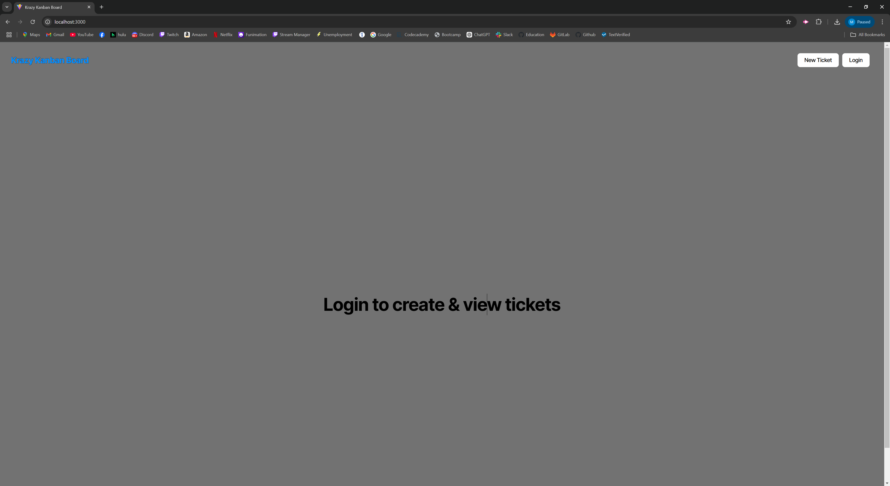
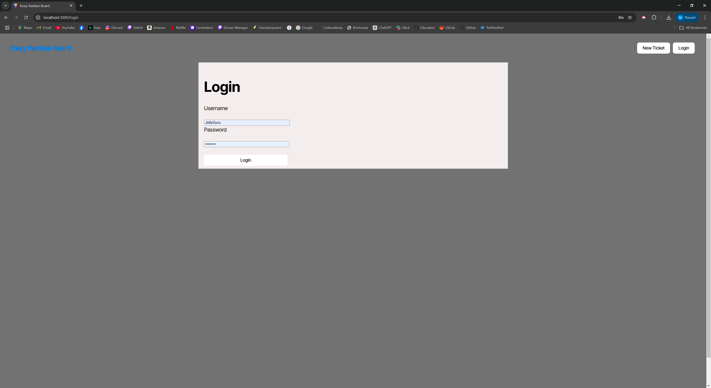
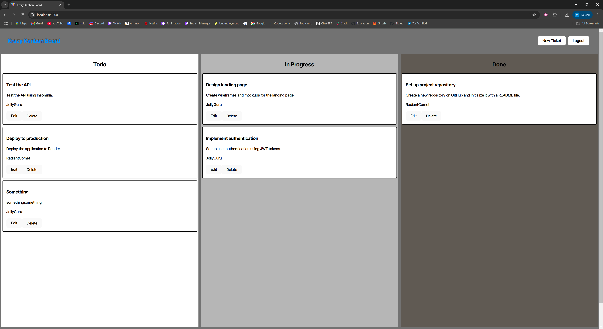
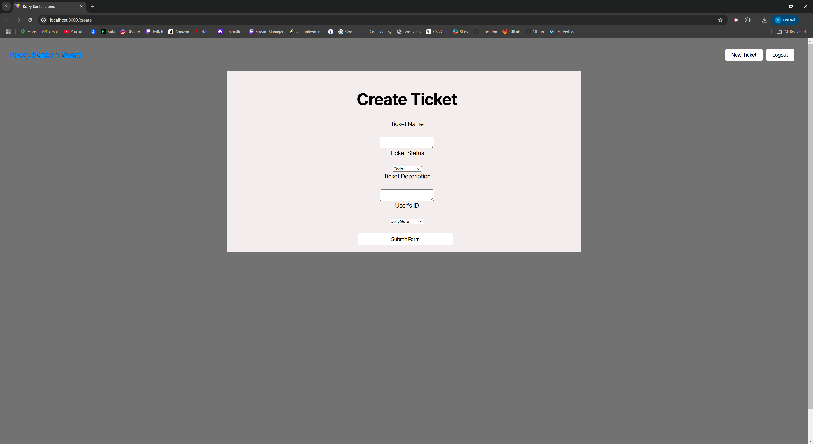

# Kanban Board Application with JWT Authentication

## Description
This project is a **Kanban board application** with **JWT-based authentication**. It allows users to manage tasks efficiently while ensuring secure access to their accounts. This project was built as part of a coding bootcamp and showcases authentication implementation, responsive UI design, and deployment to Render.

---

## Table of Contents
1. [Features](#features)  
2. [Technologies Used](#technologies-used)  
3. [Installation](#installation)  
4. [Usage](#usage)  
5. [Project Requirements](#project-requirements)  
6. [Deployment](#deployment)  
7. [Contributing](#contributing)  
8. [License](#license)  

---

## Features
- User authentication using **JSON Web Tokens (JWT)**.
- Secure login page with error handling for invalid credentials.
- JWT storage in local storage to maintain user sessions.
- Automatic logout after session expiration or inactivity.
- Ability to create, update, and delete tasks on a Kanban board.
- Optional features:
  - Sorting and filtering tickets.
  - Customization options for task categories.

## Screenshots










---

## Technologies Used
### Frontend
- **React** with **TypeScript**: For building the user interface.
- **CSS/SCSS**: For styling the application.

### Backend
- **Node.js** with **Express.js**: For server-side logic and API creation.
- **PostgreSQL** with **Sequelize ORM**: For data storage and management.
- **JWT Authentication**: For securing API endpoints.

---

## Installation

### Prerequisites
1. Install [Node.js](https://nodejs.org) (v16 or higher).
2. Install [PostgreSQL](https://www.postgresql.org/).
3. Clone this repository:
   ```bash
   git clone https://github.com/your-username/kanban-board-jwt.git
   ```

### Backend Setup
1. Navigate to the server directory:
   ```bash
   cd db
   psql -U postgres
   type: your password
   \i schema.sql
   ```
2. Navigate to the server directory:
   ```bash
   cd server
   ```
3. Install dependencies:
   ```bash
   npm install
   ```
4. Set up your environment variables in a `.env` file:
   ```env
   DB_NAME='kanban_db'
   DB_USER='postgres'
   DB_PASSWORD= 'your_password'
   JWT_SECRET_KEY='jwt_secret_key'
   ```
5. Run database migrations and seed the data:
   ```bash
   npm run build 
   npm run seed
   ```
6. Start the server:
   ```bash
   npm run start
   ```

### Frontend Setup
1. Navigate to the client directory:
   ```bash
   cd client
   ```
2. Install dependencies:
   ```bash
   npm install
   ```
3. Start the development server:
   ```bash
   npm start
   ```

---

## Usage
1. Navigate to the deployed application (or `http://localhost:3000` for local development).
2. Register for a new account or log in with an existing one.
3. Add, update, and manage tasks on your Kanban board.
4. Tasks will be sorted into categories like **To Do**, **In Progress**, and **Done**.

---

## Project Requirements
### Minimum Requirements
- A fully functional Kanban board.
- JWT-based authentication with secure token storage.
- Deployment on [Render](https://render.com).

### Acceptance Criteria
- Secure login page with error handling for invalid credentials.
- Redirecting unauthenticated users to the login page.
- Session expiration after inactivity.
- Organized project repository and environment variable usage.

### Bonus Features (Optional)
- Sorting and filtering tasks by category or due date.
- A polished and interactive user interface.

---

## Deployment
The application is deployed on **Render**.  
Visit the live app: [Kanban Board](https://your-render-app-url)

---

## Contributing
Contributions are welcome!  
To contribute:
1. Fork the repository.
2. Create a new feature branch:
   ```bash
   git checkout -b feature-name
   ```
3. Commit changes and open a pull request.

---

## License
This project is licensed under the [MIT License](LICENSE).

---
